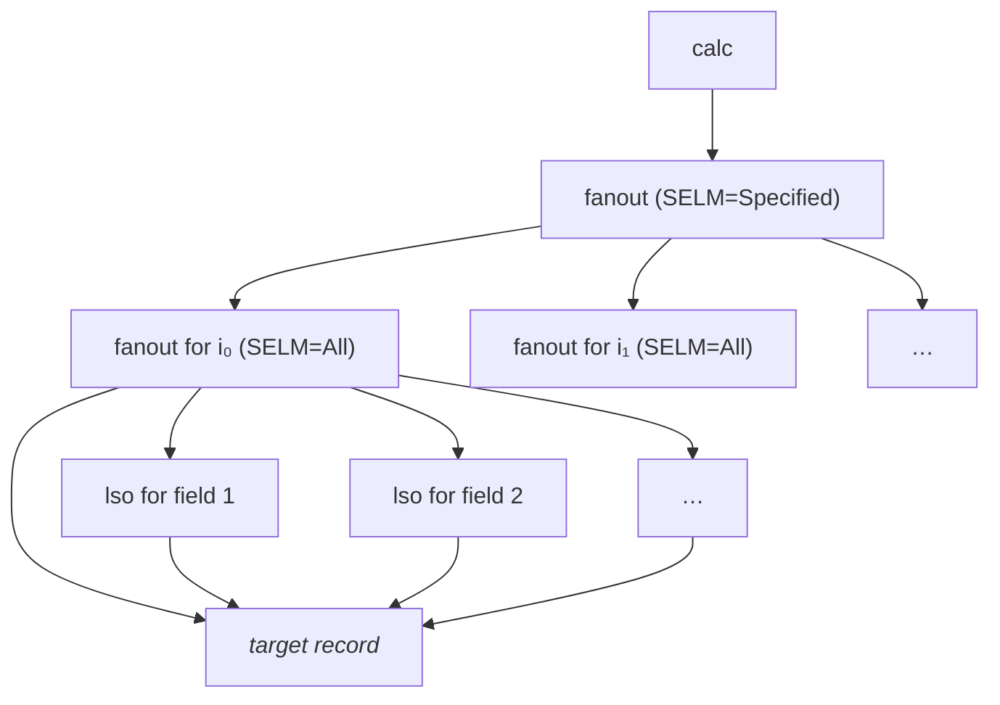

Conditional Field Adjuster for EPICS
====================================

The conditional field adjuster is a utility module for [EPICS](
https://epics-controls.org/) that allows for easy adjustment of record fields
based on the value of another record. The main application is changing alarm
limits or severities based on operational conditions, but it is possible to
update any (runtime writable) record field, not just fields related to the
alarm configuration.

Normally, the author of a record definition file would need to introduce a
couple of auxilliary records in order to change the fields configuring alarm
limits and severities. This module relieves the author from this cumbersome
task by automatically generating such records based on a few simple `info`
entries associated with the target record.

For example, take the following configuration:

```
record(mbbo, "demo:cfa:operationMode") {
  field(ZRST, "Production")
  field(ZRVL, "0")
  field(ONST, "Commissioning")
  field(ONVL, "1")
  field(TWST, "Testing")
  field(TWVL, "2")
  field(VAL,  "0")
  field(PINI, "YES")
}

record(ai, "demo:cfa:voltage") {
  field(EGU,  "V")
  field(HIHI, "10")
  field(HIGH, "5")
  field(LOW,  "-5")
  field(LOLO, "-10")
  field(HHSV, "MAJOR")
  field(HSV,  "MINOR")
  field(LSV,  "MINOR")
  field(LLSV, "MAJOR")
  info("cfa:select", "demo:cfa:operationMode CP")
  info("cfa:1:HHSV", "MINOR")
  info("cfa:1:LLSV", "MINOR")
  info("cfa:2:HIGH", "8")
  info("cfa:2:LOW",  "-8")
  info("cfa:2:HHSV", "MINOR")
  info("cfa:2:LLSV", "MINOR")
}
```

In this example, the alarm configuration of `demo:cfa:voltage` depends on the
value of `demo:cfa:operationMode`. In production mode, the alarm limits are
tight and a major alarm is raised when the value goes too far out of range. In
commissioning mode, only a minor alarm is raised. In test mode, the range in
which the value is deemed okay is increased.

Installation
------------

This module needs EPICS Base version 7.0.7 or newer. Set the path to the EPICS
Base installation in `configure/RELEASE.local`

```Makefile
EPICS_BASE = /path/to/epics/base-7.0.x
```

and run `make`.


Using
-----

In order to use this module in an IOC, the IOC must be linked with the
associated library and the DBD file must be included. Start by editing the
`configure/RELEASE` file of the IOC:

```Makefile
CONDITIONAL_FIELD_ADJUSTER = /path/to/cfa-module
```

Then, edit the `Makefile` (e.g. `myIocApp/src/Makefile`), and add the module to
the respective `_DBD` and `_LIBS` definitions. For example:

```Makefile
myIoc_DBD += conditionalFieldAdjuster.dbd
myIoc_LIBS += conditionalFieldAdjuster
```

Now you can start using this module by adding `info` entries to records. This
module handles entries with names that start with `cfa:`. The following names
can be used:

- `cfa:scan`: Specifies the value of the `SCAN` field of the internally
  generated `calc` record. The default is `Passive`. Often, combining `Passive`
  with a link specifying the `CP` flag in `cfa:select` is a good choice, but
  sometimes it might be desirable to rather process the records at a fixed
  rate. Please refer to [*Implementation Details*](#implementation-details) in
  order to understand the difference between the two options.
- `cfa:select`: Specifies the name of the record which is used to select the
  field values that shall be used. Typically, this link should specify the `CP`
  flag.
- `cfa:<index>:<field name>`: Specifies the value that the record field
  specified by `<field name>` should take when the value of the record from
  `cfa:select` is equal to `<index>`. `<index>` must be an integer number
  between 0 and 32767 (both inclusive).

When a field value is specified for some indices but not all of them, the field
is set to its default value (the value that it had initially) for the cases
where no explicit value is specified. When the record referenced by
`cfa:select` has a value that is not handled explicitly, all fields are set to
their default values.

Fields that are not specified for at least one of the cases are never touched.


Implementation details
----------------------

This module performs all its work during the initialization of the IOC. Once
the IOC is running, it is completely passive.

In the `initHookAfterInitDevSup` phase (this is the same phase were pass 0
restores by the autosave module happen), it scans all records for the
appropriate `info` entries and creates the associated record instances. All
records that are created by this module have a name with the prefix `cfa:`
followed by 30 random, alpha-numeric characters.

The records created for each target record have the following structure (each
arrow indicates a forward link from one record to another one):



At the top is a `calc` record that references the record specified through
`cfa:select`. This record has a forward link to a `fanout` record with `SELM`
set to `Specified`. Each of the links in this `fanout` record point to a
`fanout` record that handles the case when the reference value is one specific
number. This `fanout` record, in turn, points to `lso` records that write to
the various fields of the target record and it also points to the target record
itself, so that this record is processed after the fields have been updated.

Depending on the number of cases handled and the number of fields updated, each
of the `fanout` records may actually be represented by a chain of several
`fanout` records, but this does not change anything about the general
processing sequence.

The processing of the records and thus the updating of the target fields always
starts with the `calc` record at top. The processing of this record can be
triggered through two different mechanisms:

1. The link to the referenced record can specify the `CP` flag, thus processing
  the `calc` record every time when the value of the referenced record changes.
2. The `calc` record can be processed periodically by setting its `SCAN` field
  through `cfa:scan`.

As each processing of the `calc` record eventually triggers processing of the
target record, the method has to be chosen carefully to match the expected
behavior of the target record.

If the target record is only processed occassionally (like it is typical for
most output records), the first method is typically better suited. If it is
supposed to be processed periodically, the second method might be a better
choice.

In the latter case, it may be best to set the `SCAN` field of the target record
to `Passive` and set `cfa:scan` to the intended poll interval. This has the
effect that the target record is processed at the intended rate, updating the
fields at the same time.

When the conditional field adjuster is used to update fields of type `FWDLINK`,
`INLINK` or `OUTLINK`, the link from the respective `lso` record to the field
of the target record is a Channel Access link. The reason is that internal
database links do not work in this case. Depending on how the target record
handles Channel Access put operations to these fields, this may result in the
target record to be processed more than once for each processing of the `calc`
record.
